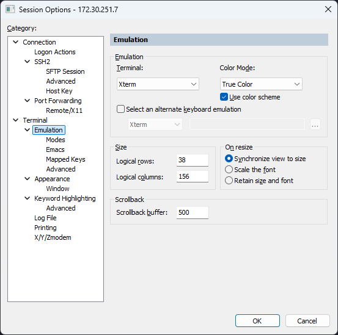

# dotfiles

개인적으로 사용하는 dotfile들과 기타 설정들에 대해 정리하였습니다.

## secureCRT



nvim 컬러 설정을 secureCRT에서 인식하지 못하곤 함. True Color로 바꿀 것.


## window

ps1, wt, wsl을 기본으로 사용합니다.  
wsl에선 bash 기반의 툴셋이 여기서도 활용됩니다.
window native한 구성에는 추가적으로 아래 도구들도 활용합니다.

-   https://www.hanselman.com/blog/scott-hanselmans-2021-ultimate-developer-and-power-users-tool-list-for-windows
-   https://www.hanselman.com/blog/taking-your-powershell-prompt-to-the-next-level-with-windows-terminal-and-oh-my-posh-3

### visual studio

-   기본 세팅

    -   [도구] - [설정 가져오기 및 내보내기] - [visual c++ 기본]

-   코드 스타일
    [도구] - [옵션] - [C/C++] - [코드 스타일]

    -   괄호 안에서 새 줄 입력 시 맞춤 - 여는 괄호에 내용을 맞춥니다.
    -   [서식] - [래핑] - 블록에 대한 래핑 옵션 - 블록에 항상 줄바꿈 설정을 적용합니다.
        [도구] - [옵션] - [IntelliSEnse] - [inlay lint]

-   snippet

    -   [경로](./visualstudio/) 에 있는 .snippet 들을 visual studio에서 등록합니다.

-   UAC
    -   [프로젝트] - [속성] - [링커] - [매니페스트 구성] - [UAC 실행 수준] UAC requireAdministrator 혹은 원하는 수준으로
    -   혹은 visual studio 자체를 권리자 권한으로 실행해도 된다. 그러나 전자를 추천.

### ps1 관리 권한

```ps1
Get-ExecutionPolicy
Set-ExecutionPolicy RemoteSigned or something...
```

### conda

-   Anaconda Prompt를 관리자 권한으로 실행
-   conda init powershell (Conda를 PowerShell 환경에서 사용할 수 있도록 설정 파일을 수정)

### excel

-   [파일] - [옵션] - [추가기능] - 관리, Excel 추가 기능 이동 후 분석 도구 모두 추가

## Unix

### .tool-versions for asdf

node, python, golang 버저닝에 asdf를 사용합니다.  
nvm, pyenv, gvm는 사용하지 않습니다.

### tmux

back buffer의 크기를 10000으로 늘리고, mouse 조작을 활성화합니다.
.tmux.conf를 참조하십시오

### alacritty

https://johngrib.github.io/wiki/tools/alacritty/

### nvim

원격 서버의 disk, mem 용량이 제한적일 때와 같이 제한적인 상황에서만 사용 중입니다.  
원격 서버 연결시 .vscode-server의 용량은 꽤나 큽니다. golang과 c/cpp 작업 환경을 위한 extention을 설치하고 사용하니 2GB 정도를 사용하는 것으로 보입니다.

```bash
:h rtp # look up runtimepath

space + pf # file search
space + pv # explorer
space + ps # grep file search

ctrl + e # toggle harpoon nav
space + a # harpoon file add

space + u # toggle undo tree
```

### shell theme, fonts etc

agnoster theme에 powerline 지원이 되는 font를 선호합니다.  
editor엔 Consolas, terminal은 Roboto Mono for Powerline을 사용합니다.

### ref

https://subicura.com/2017/11/22/mac-os-development-environment-setup.html
