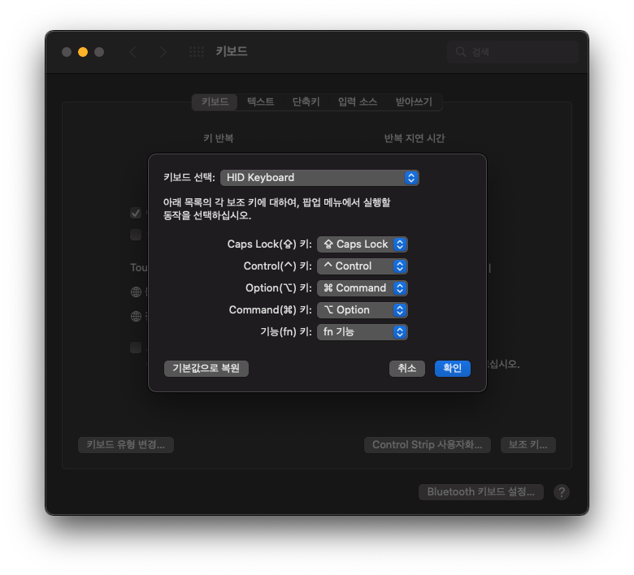
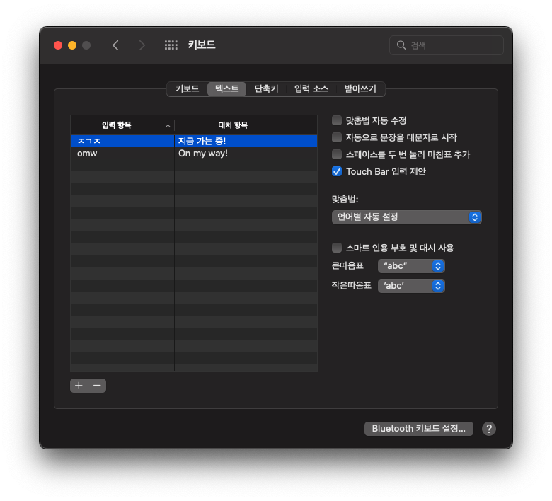
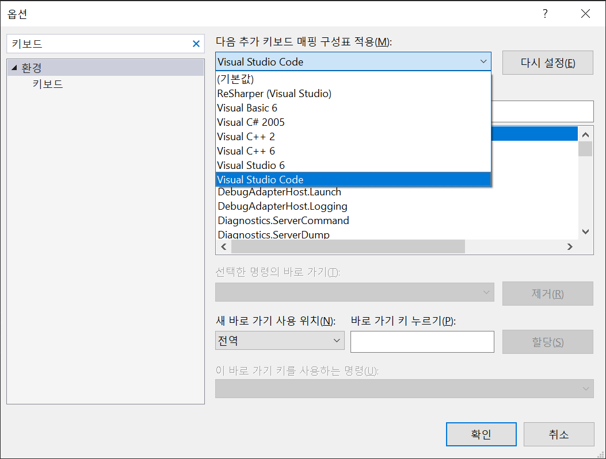

# dotfiles

개인적으로 사용하는 dotfile들과 기타 설정들에 대해 정리하였습니다.

## window

ps1, wt, wsl을 기본으로 사용합니다.  
wsl에선 bash 기반의 툴셋이 여기서도 활용됩니다.  
window native한 구성에는 추가적으로 아래 도구들도 활용합니다.  

- https://www.hanselman.com/blog/scott-hanselmans-2021-ultimate-developer-and-power-users-tool-list-for-windows
- https://www.hanselman.com/blog/taking-your-powershell-prompt-to-the-next-level-with-windows-terminal-and-oh-my-posh-3

## .tool-versions for asdf

node, python, golang 버저닝에 asdf를 사용합니다.  
nvm, pyenv, gvm는 사용하지 않습니다.


## tmux

back buffer의 크기를 10000으로 늘리고, mouse 조작을 활성화합니다.
.tmux.conf를 참조하십시오

## 키보드

윈도우 기반의 키보드를 맥의 내장 키보드와 순서를 맞추기 위해 다음과 같이 변경합니다

<details>
<summary>keyboard_option_cmd_change</summary>
<center>
    
</center>
</details>

auto fix 기능을 모두 끕니다

<details>
<summary>keyboard_auto_fix_disable</summary>
<center>
    
</center>
</details>

## alacritty

https://johngrib.github.io/wiki/tools/alacritty/

## nvim

원격 서버의 disk, mem 용량이 제한적일 때와 같이 제한적인 상황에서만 사용 중입니다.  
원격 서버 연결시 .vscode-server의 용량은 꽤나 큽니다. golang과 c/cpp 작업 환경을 위한 extention을 설치하고 사용하니 2GB 정도를 사용하는 것으로 보입니다.

```bash
:h rtp # look up runtimepath

space + pf # file search
space + pv # explorer
space + ps # grep file search

ctrl + e # toggle harpoon nav
space + a # harpoon file add

space + u # toggle undo tree
```

## vs

키보드 매핑을 vscode 처럼 변경

<details>
<summary>keyboard_auto_fix_disable</summary>
<center>
    
</center>

</details>

## ref

https://subicura.com/2017/11/22/mac-os-development-environment-setup.html
